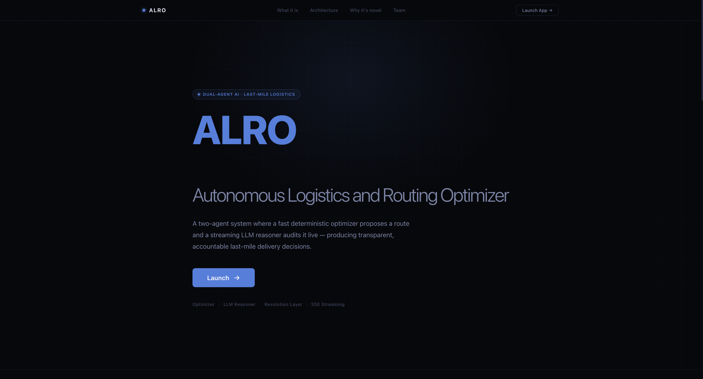
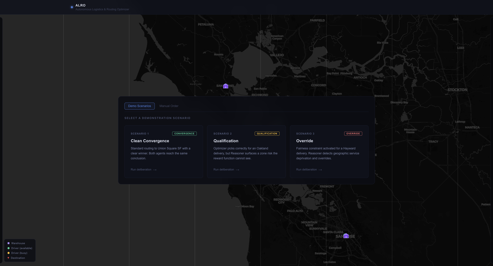
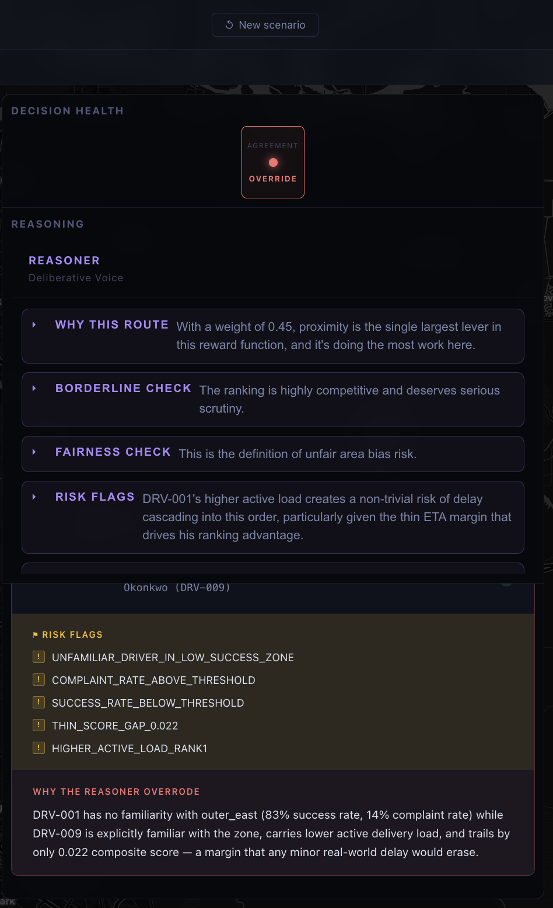
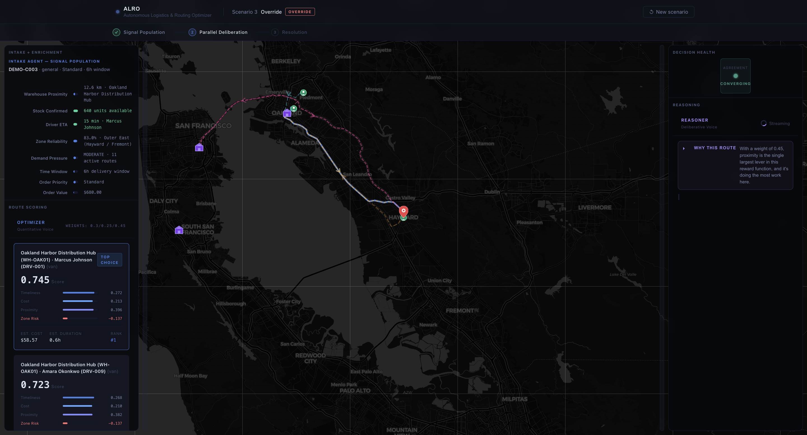
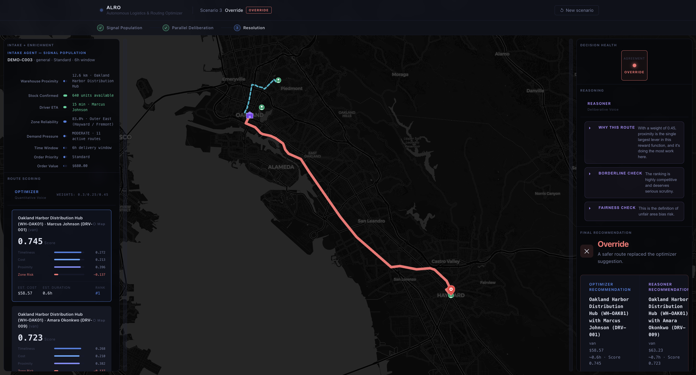
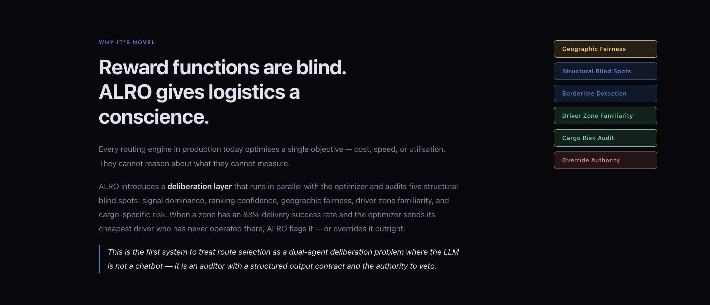

# ALRO — Autonomous Logistics & Routing Optimizer

> **A decision that cannot be explained will not be acted on.**

ALRO is an AI-driven logistics decision engine that runs two independent agents in parallel — one that *scores*, one that *reasons* — and streams their deliberation live to a human operator. The result is auditable, trustworthy AI routing with a built-in fairness constraint.

**Live Deployment:** [https://alro.dan-cmpe272.com](https://alro.dan-cmpe272.com) *(hosted on AWS EC2)*

---

## Screenshots

### Landing Page


### Home Screen — Live Route Map


### Reasoner Agent — Chain-of-Thought Streaming


### Override Scenario — Before


### Override Scenario — After Fairness Intervention


### Novelty Reasoning Output


---

## The Core Idea

Enterprise AI adoption fails not because models lack capability, but because operators cannot understand or trust the decisions being made. ALRO addresses this directly:

- **Optimizer Agent** scores every routing option against a calibrated reward function (quantitative voice)
- **Reasoner Agent** uses Claude LLM to audit that choice through chain-of-thought analysis (deliberative voice)
- Operators watch both agents work in real time — seeing when they agree, when they diverge, and how conflicts resolve

Three possible outcomes surface from every deliberation:

| Outcome | Meaning |
|---|---|
| **Convergence** | Both agents agree — high-confidence dispatch |
| **Qualification** | Optimizer is right, but Reasoner flags a risk to surface |
| **Override** | Fairness constraint or structural blind spot triggers a different recommendation |

---

## Architecture

```
┌──────────────────────────────────────────────────────────────────┐
│                     React Frontend  (Port 3000)                  │
│                                                                  │
│   Landing Page → Scenario Selector → 3-Phase Deliberation UI    │
│                                                                  │
│   ┌─────────────────┐  ┌──────────────────┐  ┌───────────────┐  │
│   │ Phase 1         │  │ Phase 2          │  │ Phase 3       │  │
│   │ Signal Reveal   │→ │ Split Deliberation│→ │ Resolution    │  │
│   │ (animated)      │  │ (live SSE stream) │  │ (attributed)  │  │
│   └─────────────────┘  └──────────────────┘  └───────────────┘  │
│                                                                  │
│         useDeliberation Hook (State Machine)                     │
│         RouteMap — Leaflet + OpenRouteService (always on)        │
└──────────────────────┬───────────────────────────────────────────┘
                       │ HTTP + Server-Sent Events (SSE)
                       │
┌──────────────────────▼───────────────────────────────────────────┐
│                  Microservice Layer (Docker Compose)             │
│                                                                  │
│  ┌─────────────┐  ┌──────────────┐  ┌────────────┐  ┌────────┐  │
│  │ ERP Service │  │ Intake Agent │  │ Optimizer  │  │Reasoner│  │
│  │  Port 8001  │  │  Port 8002   │  │ Port 8003  │  │Port 8004│ │
│  │             │  │              │  │            │  │        │  │
│  │ Warehouses  │→ │ Enriches     │→ │ Scores all │→ │LLM CoT │  │
│  │ Drivers     │  │ raw orders   │  │ routing    │  │+ Fair- │  │
│  │ Zone data   │  │ into Feature │  │ options vs │  │ness    │  │
│  │ Orders      │  │ Vectors      │  │ reward fn  │  │Check   │  │
│  └─────────────┘  └──────────────┘  └────────────┘  └────────┘  │
└──────────────────────────────────────────────────────────────────┘
```

### Data Flow

```
 User Input
     │
     ▼
 POST /api/intake/enrich  ──►  ERP lookup  ──►  FeatureVector
     │
     ▼
 POST /api/optimizer/score  ──►  Reward function  ──►  Ranked RoutingOptions
     │
     ▼
 SSE /api/reasoner/reason  ──►  LLM token stream  ──►  Conclusion + Resolution
     │
     ▼
 Frontend renders all 3 phases with map updates + score breakdowns
```

---

## Tech Stack

### Frontend
| Technology | Role |
|---|---|
| React 19 + Vite | UI framework and build tool |
| Leaflet + react-leaflet | Interactive route map |
| OpenRouteService API | Real road-based route geometry |
| Server-Sent Events (SSE) | Live token streaming from Reasoner |
| React Markdown | Structured reasoning display |

### Backend (Four Python/FastAPI Microservices)
| Service | Port | Role |
|---|---|---|
| ERP Service | 8001 | Mock warehouse — locations, stock, drivers, zones |
| Intake Agent | 8002 | Enriches raw orders into FeatureVectors |
| Optimizer Agent | 8003 | Scores routing options against calibrated reward function |
| Reasoner Agent | 8004 | LLM chain-of-thought audit + fairness check + resolution |

### AI / Orchestration
| Technology | Role |
|---|---|
| Anthropic Claude (default: claude-sonnet-4-6) | Reasoner LLM |
| OpenAI GPT-4o | Alternative LLM provider |
| Ollama | Self-hosted local LLM option |
| LangGraph | Agent orchestration |

### Infrastructure
| Technology | Role |
|---|---|
| Docker Compose | Orchestrates all five services |
| AWS EC2 | Production deployment |
| FastAPI + Uvicorn | Async HTTP servers |
| Pydantic v2 | Request/response validation |

---

## Reward Function

The Optimizer scores every (warehouse, driver) pair using:

```
composite_score = (timeliness_score × w1)
                + (cost_efficiency_score × w2)
                + (proximity_score × w3)
                − zone_risk_penalty
```

| Component | Description |
|---|---|
| **Timeliness** | 1.0 at dispatch, 0.0 at deadline, negative when late |
| **Cost Efficiency** | Normalized against £400 ceiling |
| **Proximity** | Warehouse→destination + driver→warehouse distances averaged |
| **Zone Risk Penalty** | Computed from delivery success rate and complaint rate |

Weights are tuned per order priority: `critical`, `urgent`, `standard`.

---

## Deliberation Scenarios

Three scenarios are pre-seeded, each engineered to trigger a different resolution state:

| # | Location | Zone Health | Feature | Expected Resolution |
|---|---|---|---|---|
| **1** | Union Square, SF | Healthy | Clear numeric winner | ✅ **Convergence** — Both agents agree |
| **2** | Oakland / East Bay | Below threshold | Score is right, but zone is risky | ⚠️ **Qualification** — Optimizer correct, risk flagged |
| **3** | Hayward / Outer East | Chronically underserved | Cost optimization would deprioritize underserved zone | 🔄 **Override** — Fairness constraint triggers alternative |

---

## Reasoner's 5-Point Analysis

Every deliberation follows a structured prompt:

1. **Signal Analysis** — Which reward component dominates?
2. **Borderline Check** — Is the ranking close enough that real-world variation could flip it?
3. **Geographic Fairness Check** — Does this route deprioritize underserved zones?
4. **Structural Blind Spots** — What can't the reward function see? (driver familiarity, cargo risk, time window)
5. **Conclusion** — `CONFIRM` / `QUALIFY` / `OVERRIDE` with stated reason, streamed token by token

---

## Deployment

ALRO is deployed on **AWS EC2** and is publicly accessible at:

**[https://alro.dan-cmpe272.com](https://alro.dan-cmpe272.com)**

The production stack uses Docker Compose to orchestrate all five services on a single EC2 instance, with environment variables injected at runtime for API keys and service URLs.

---

## Setup & Installation

### Prerequisites

- Python 3.11+
- Node.js 20+
- Docker + Docker Compose
- An [Anthropic API key](https://console.anthropic.com/) (or OpenAI key / local Ollama)
- An [OpenRouteService API key](https://openrouteservice.org/) (free tier available)

### 1. Clone the Repository

```bash
git clone https://github.com/kunal768/ai-alro.git
cd ai-alro
```

### 2. Configure Environment Variables

**Backend**

```bash
cp backend/.env.example backend/.env
```

Edit `backend/.env`:

```env
# Service URLs (used internally by Docker; change to localhost:800X for local dev)
ERP_SERVICE_URL=http://erp_service:8001
INTAKE_AGENT_URL=http://intake_agent:8002
OPTIMIZER_AGENT_URL=http://optimizer_agent:8003
REASONER_AGENT_URL=http://reasoner_agent:8004

# LLM Provider — choose one: anthropic | openai | ollama
LLM_PROVIDER=anthropic
LLM_MODEL=claude-sonnet-4-6
LLM_TEMPERATURE=0

# API Keys
ANTHROPIC_API_KEY=sk-ant-...
OPENAI_API_KEY=sk-...          # Only if using OpenAI
OLLAMA_BASE_URL=http://localhost:11434/v1  # Only if using Ollama
```

**Frontend**

```bash
cp frontend/.env.example frontend/.env
```

Edit `frontend/.env`:

```env
VITE_ORS_API_KEY=your_openrouteservice_key
VITE_ORS_BASE_URL=https://api.openrouteservice.org
VITE_ORS_PROFILE=driving-car
```

---

## Running the Project

### Option A — Docker Compose (Recommended)

Runs all five services with one command:

```bash
docker-compose up --build
```

| Service | URL |
|---|---|
| Frontend | http://localhost:3000 |
| ERP Service | http://localhost:8001/docs |
| Intake Agent | http://localhost:8002/docs |
| Optimizer Agent | http://localhost:8003/docs |
| Reasoner Agent | http://localhost:8004/docs |

To stop:

```bash
docker-compose down
```

---

### Option B — Local Development

Run each service in a separate terminal.

**Backend services (run each in its own terminal):**

```bash
cd backend

# Create and activate virtual environment
python3 -m venv .venv
source .venv/bin/activate          # Windows: .venv\Scripts\activate
pip install -r requirements.txt

# Terminal 1 — ERP Service
uvicorn erp_service.main:app --port 8001 --reload

# Terminal 2 — Intake Agent
uvicorn intake_agent.main:app --port 8002 --reload

# Terminal 3 — Optimizer Agent
uvicorn optimizer_agent.main:app --port 8003 --reload

# Terminal 4 — Reasoner Agent
uvicorn reasoner_agent.main:app --port 8004 --reload
```

> For local dev, set service URLs in `.env` to `http://localhost:8001` etc.

**Frontend:**

```bash
cd frontend
npm install
npm run dev
# → http://localhost:5173
```

---

### Option C — Backend Dev Script

```bash
cd backend
bash run_dev.sh
```

This starts all four backend services sequentially.

---

## Running Tests

```bash
cd backend
source .venv/bin/activate
pytest tests/
```

Integration tests (requires services running):

```bash
python test_intake.py       # ERP + Intake
python test_reasoner.py     # Full reasoning pipeline
```

---

## Project Structure

```
ai-alro/
├── backend/
│   ├── erp_service/        # Mock ERP — warehouses, drivers, zones
│   ├── intake_agent/       # Order enrichment → FeatureVector
│   ├── optimizer_agent/    # Reward function + scoring
│   ├── reasoner_agent/     # LLM chain-of-thought + resolution
│   ├── shared/             # Pydantic models, utils (haversine, zones)
│   ├── tests/              # Pytest test suite
│   ├── requirements.txt
│   └── run_dev.sh
├── frontend/
│   ├── src/
│   │   ├── components/     # React components (phases, map, header)
│   │   ├── hooks/          # useDeliberation state machine
│   │   └── App.jsx
│   ├── package.json
│   └── vite.config.js
├── public/                 # Screenshots
├── docker-compose.yml
├── CONCEPT.md              # Architecture thesis and design decisions
└── README.md
```

---

## Evaluation Dimensions

ALRO is designed to be measured across 13 dimensions:

| Dimension | Description |
|---|---|
| Decision Quality | Does the final route make operational sense? |
| Reasoning Coherence | Is the chain-of-thought logically sound? |
| System Integrity | Are all agents behaving within spec? |
| Fairness | Does the system avoid geographic service deprivation? |
| Explainability | Can an operator understand *why* this route was chosen? |
| Latency | Is deliberation fast enough for real dispatch? |
| Adaptability | Can weights and thresholds be tuned without code changes? |
| Failure Tolerance | Does each agent degrade gracefully? |
| Driver Impact | Are driver assignments equitable? |
| Trust Signal | Is the operator more confident after seeing reasoning? |
| Regulatory Coherence | Does the system respect geographic service obligations? |
| Model Boundary Honesty | Does the system admit what it cannot know? |
| Generalisability | Can the architecture transfer to non-logistics domains? |

---

## Failure Tolerance

Each agent has a defined degraded mode:

| Agent | Failure Behavior |
|---|---|
| Intake | Hold order, surface enrichment failure to operator |
| Optimizer | Fall back to distance-only routing; degraded banner shown |
| Reasoner | Proceed on Optimizer output alone; degraded banner shown |
| Resolution | Default to Optimizer recommendation, log conflict for review |

---

## Team Contributions

> All commits were discussed together as a team before implementation. Every architectural decision, API contract, and design choice was a shared agreement — the attributions below reflect primary ownership, not isolated work.

---

### Kunal Sahni
**Role: Project Architecture & Quality**

- Authored the project concept and architecture thesis ([CONCEPT.md](CONCEPT.md)), establishing the two-agent deliberation model and the core argument around AI interpretability
- Scaffolded the full monorepo structure and initial service layout in the first commit
- Built the landing page and header UI components
- Owned the test infrastructure — set up `pytest`, wrote the component test suite, and ensured all backend services were verifiably correct before integration

---

### Dan Lam
**Role: Backend Scoring, Deliberation UI & DevOps**

- Built and calibrated the Optimizer Agent's reward function — timeliness, cost efficiency, proximity scoring, and zone risk penalty
- Implemented the demo scenario engine (`demo_scenarios.py`) including the scenario matching and estimated duration calculations
- Built the split-panel deliberation interface — animated signal weights, parallel Optimizer/Reasoner views, the agreement indicator, and convergence/override resolution states
- Implemented the SSE streaming layer on the frontend (`useDeliberation.js`, `sseParser.js`)
- Finalized Docker Compose containerization across all five services with health checks and `.env`-based API key configuration
- Deployed and configured the production environment on **AWS EC2** at [alro.dan-cmpe272.com](https://alro.dan-cmpe272.com)
- Wrote the presentation overview and demo narrative

---

### Dhruv Verma
**Role: Reasoning Layer, Map & Frontend UX**

- Migrated the full dataset from London to Bay Area geography, authoring the ERP seed data with nine Bay Area zones, warehouse coordinates, and driver profiles
- Built the Reasoner Agent's chain-of-thought reasoning pipeline (`reasoning.py`) — prompt engineering, fairness constraint implementation, and the resolution layer
- Integrated the Intake Agent's order enrichment logic including multi-leg route support
- Built the interactive Leaflet map with real road-based route geometry via OpenRouteService
- Implemented resizable simulation panels, manual order UX, and natural language order input
- Drove the UI overhaul that unified map-first layout with the three-phase deliberation flow

---

## License

MIT
